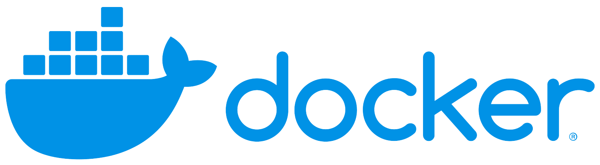

  

    <picture>
      <source media="(prefers-color-scheme: dark)" srcset="assets/images/stock/pantera-1.4.png">
      <source media="(prefers-color-scheme: light)" srcset="assets/images/stock/pantera-1.3.png">
      
    </picture>
  

   

  
  
  
  

    <picture>
     
    </picture>

 

# Overview
In this documentation, I will do my best to introduce, explain, and familiarize you with Docker containers. This repository covers various topics related to Docker containers, assuming you already have a basic understanding of what containers are, with the goal of achieving mastery.
By the time you finish studying this repository, you will hopefully have a complete understanding of Docker. Good luck!

 

## Quick Refresh: What Are Containers?
Containers are a lightweight, portable, and efficient way to package and run applications. They provide a **consistent environment** across different computing platforms, eliminating the classic "it works on my machine" problem. Containers achieve this by bundling an application with all its dependencies, libraries, and configurations into a single unit.  

To truly grasp the significance of containers, let's first understand the problem they solve.

### The Problem Before Containers
Before containers, developers relied on two primary ways to deploy applications:

1. **Traditional Deployment on Physical Servers**
    Applications were installed directly onto a physical machine.
    Issues: Resource conflicts, dependency hell, inefficient use of hardware, and high maintenance.

2. **Virtual Machines (VMs)**
    VMs allowed multiple OS instances to run on the same hardware.
    Issues: Heavyweight, slow to start, consumes large amounts of memory and CPU.

### How Containers Solve These Problems
Containers offer a middle ground between traditional deployment and VMs by isolating applications while sharing the same OS kernel.

|   **Feature** |   VMs |   Containers  |
|:--------------|------:|--------------:|
|   **Size**    |   Large (GBs, includes full OS)   |   Lightweight (MBs)   |
|   **Boot Time**   |   Minutes |   Seconds |
|   **Ressource Use**   |   High (each VM needs full OS)    |   Low (shares OS kernel)  |
|   **Portability** |   Limited (specific VM settings)  |   Highli portable |
|   **Efficiency**  |   Less efficient due to overhead  |   More efficient  |

 

## How Containers Work
A container consists of the **application code** and all the dependencies it needs to run. But unlike a virtual machine, it does **not include a full operating system**. Instead, it **shares the OS kernel** of the host machine while maintaining process isolation.

Key components of a containerized environment:

1. **Container Image** – A blueprint that defines what’s inside the container (like a recipe).
2. **Container Runtime** – The engine that runs and manages containers (e.g., Docker, containerd, Podman).
3. **Container Orchestration** – Manages multiple containers in a production environment (e.g., Kubernetes).

# Installation Process
Before diving into the actual installation process, you'll need to decide which type of installation is best suited for you. There are several options to choose from, each with its own benefits and drawbacks. Here's a comparison:

|   Option  |   Best For   |   Pros    |   Cons    |    Ideal Use Case  |
|:----------|-------------:|----------:|----------:|-------------------:|
|**Docker Desktop (Local Machine)**|Development, testing, and learning|Easy to set up, great for development, includes Docker Compose|   Resource-heavy, limited for production use|Developers working locally on applications|
|**Docker on Ubuntu Server**|Small deployments and self-hosting|More control, efficient resource usage, scalable|Requires manual setup, needs security management|Self-hosting small production workloads|
|**Cloud-Based Docker Services**|Production-scale deployments without maintenance|Highly scalable, low maintenance, built-in security and backups| Expensive, less control over the infrastructure|Enterprises deploying at scale with minimal infrastructure management|
|**Lightweight Container OS**|High-performance, lightweight container hosting|Minimal OS overhead, optimized performance, enhanced security| Limited general-purpose use, some missing OS features|Organizations running large-scale containerized workloads|
|**Docker in a Virtual Machine**|Testing, homelabs, and isolated environments|Isolated environment, flexible OS choices, great for testing|Higher resource usage due to virtualization overhead|Homelab users or businesses testing container environments|

 

My personal preference is either hosting it myself via an Ubuntu Server or using cloud services like AWS, Azure, etc. For the sake of this documentation, I will do my best to install and configure it in every possible way.

## Docker Desktop Installation
You can download the Docker Desktop software [here](https://www.docker.com/products/docker-hub/). Be sure to check the system requirements before installing.

## Docker on Ubuntu Server

## Cloud-Based Docker Services

## Lightweight Container OS

## Docker in a VM
